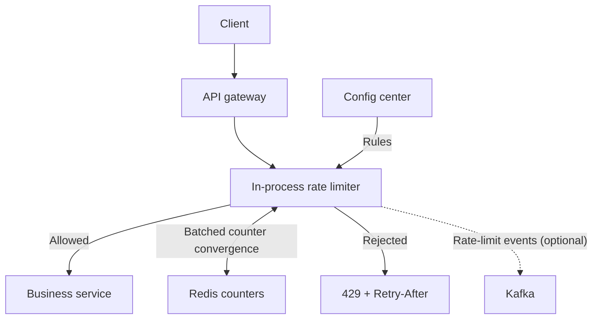

# Q2 · Rate Limiter

> Difficulty: Easy–Medium | archetype: algorithmic deep dives + distributed consistency
> The problem is small, but **the four-way algorithm comparison plus the distributed clock problem** can drill all the way down to the floor of your E5 knowledge.

## 1. Problem Statement

"Design an API rate limiter to prevent abuse. It needs to support N requests per second / per minute per user."

## 2. Clarifying Questions

| Question | Intent |
|------|------|
| What dimension are we limiting on? (IP / user / API key / global) | Determines the rate limiting key design |
| Hard limit or soft limit? (return 429 when exceeded, or queue?) | Availability orientation |
| Distributed or single-machine rate limiting? | The dividing line for this problem |
| Do rules need to be pushed down dynamically? | Brings in a config center |
| Rate limiting semantics: average rate vs burst capacity | Points straight at the algorithm choice |

## 3. Estimation (brief—this problem doesn't get hung up on numbers)

"Assume 100K QPS peak and 20 million active keys—the rate limiting decision itself must be <1ms P99 and must not become a new bottleneck, so it has to be an **in-memory operation**. That's the first design constraint of this problem."

## 4. High-Level Design

**Key architecture decision**: "Rate limiting is done **in-process in the gateway/middleware**; Redis only handles cross-instance counter convergence (async/quasi-sync). A synchronous Redis call on every request turns the rate limiter itself into a 200K QPS Redis cluster—the cure is worse than the disease."

## 5. Data Model

Redis: `rate:{user_id}:{window_start}` → counter / token bucket state (atomic read-modify-write via Lua script).
Rule center: `rule_id → {key_template, algorithm, limit, window, burst}`.

## 6. Deep Dives

### Deep Dive A · The four algorithms (must-know, memorize them as a comparison table)

| Algorithm | How it works | Pros | Fatal flaw |
|------|------|------|---------|
| Fixed window | Counter resets every N seconds | Simplest, memory-efficient | **Window boundary burst**: 2N can get through at the seam between two windows |
| Sliding window log | Records every request timestamp | Exact | Memory is O(QPS×window), unusable at high traffic |
| **Sliding window counter** | Current window counter ×(1-elapsed fraction) + previous window counter ×elapsed fraction | Smooth approximation, O(1) memory | Still approximate at the seam between two windows |
| **Token bucket** | Bucket capacity b, tokens added at a constant rate r | **Allows controlled bursts**, the industry default (Guava/WFF) | You must explain the parameter semantics clearly (b and r are separate) |

E5 framing: "The default answer is token bucket—because it splits 'average rate' and 'burst capacity' into two orthogonal parameters, which matches real traffic patterns. If the business explicitly disallows any burst (say, to protect a fragile downstream), switch to leaky bucket shaping. Cloudflare's production system uses a sliding window counter (their blog posts are worth reading)."

### Deep Dive B · Distributed: sync vs async (the E5 dividing line for this problem)

**Sync mode** (query Redis on every request with an atomic Lua check):
- Exact, but Redis becomes part of the critical path—if it goes down, the rate limiter goes down with it
- Mitigation: Redis cluster plus consistent hashing to spread the keys

**Async mode** (decide locally, periodically reconcile with Redis):
- Rate limiting keeps working even if Redis dies (degrade to standalone rate limiting) → **availability first**
- Cost: across instances the total will **briefly over-limit** (say 1.1N gets through)—"For an anti-abuse scenario, 10% over-limit in exchange for the rate limiting system itself never becoming a failure point is a trade-off I accept deliberately and write into the design doc."

If asked "what if it has to be exact" → sync mode plus Redis HA, and "exact rate limiting is itself a strongly consistent requirement, and that cost has to be explained to the business."

### Deep Dive C · Clock and fairness

- How clock drift across instances affects window computation (use a monotonic clock plus timestamp calibration from Redis as the central authority)
- The memory cost of the sliding window is amplified with many keys → shard by key hash
- Cold start: local counters reset to zero after a service restart → warm up quickly from Redis

### Deep Dive D · Response design after rate limiting

- 429 with a `Retry-After` header plus `X-RateLimit-Remaining` (API friendliness—plenty of seniors miss this)
- Tiered rate limiting: coarse-grained at the gateway tier (IP) plus fine-grained at the service tier (user + endpoint)
- Rate-limited events go to Kafka → attack detection / rule tuning

## 7. Red Flags

- Only knowing the "fixed window counter + Redis INCR" tier and being unable to explain the boundary burst problem
- Putting a synchronous Redis call on the critical path without discussing what happens when Redis dies
- Not knowing that burst and rate are two separate parameters in a token bucket
- No degradation plan (the rate limiter itself taking down the whole site = a design incident)

## 8. One-Minute Elevator Pitch

"In-process token buckets make the decision (r controls the average, b controls the burst), and Redis handles cross-instance counter convergence. Sync mode is exact but puts Redis on the critical path, so I default to async reconciliation plus degrade-to-standalone rate limiting, accepting 10% over-limit in exchange for availability—for an anti-abuse scenario that trade-off holds up. Rules are pushed down from a config center to support hot reload, rate-limited requests come back with Retry-After, and events go to Kafka for analytics. If the downstream were something like billing and had to be exact, I'd switch to sync plus a Redis cluster and spell out the cost."

---
← [Q1 short URL](01-url-shortener.md) | [Q3 Top-K →](03-top-k-heavy-hitters.md)
