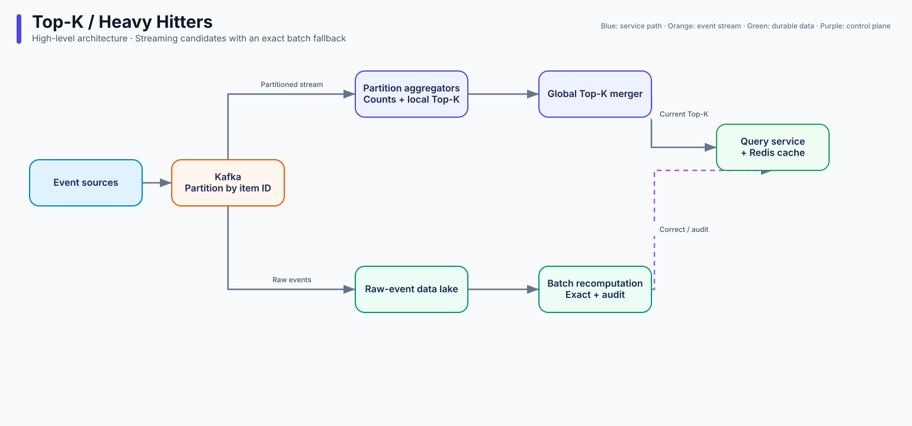

# Q3 · Top-K / Heavy Hitters

> Difficulty: Medium | archetype: write-heavy + peak shaving (streaming algorithms)
> A high-frequency E5 problem. What it tests is the **accuracy vs memory vs latency** triangle, and one problem covers the entire streaming worldview.

## 1. Problem Statement

"Design a system that computes, in real time, the top 10 most-visited URLs / most-played songs / hottest tags in our service, at two granularities such as hourly and daily."

## 2. Clarifying Questions

| Question | Intent |
|------|------|
| How real-time does "real-time" need to be? (second-level / minute-level / hour-level) | Determines whether the whole architecture is streaming or batch |
| Does Top-K need to be **exact** or **approximate** (is a ±1% error margin acceptable)? | The most important question here; it directly determines the algorithm |
| How do we handle ties at rank K? | Boundary awareness |
| All-time totals vs a rolling window? | Determines whether window aggregation is needed |
| How much traffic? (on the order of 1B events/day?) | Memory feasibility math |

## 3. Estimation Walkthrough

```
1B events/day ≈ 12K events/s average, peak ×5 ≈ 60K/s
distinct items after dedup (cardinality): assume 100M distinct URLs
exact counter memory = 100M × (8B key fingerprint + 8B counter) ≈ 1.6GB — actually feasible!
takeaway → ask first: if cardinality is bounded, the exact approach's memory holds up, so don't rush to an approximate algorithm
```

**This step is the E5 key**: plenty of people memorize Count-Min Sketch and reach for it blindly, but an exact hash table for 100M cardinality is only 2GB, which fits on a single machine. **Do the math first, then pick the algorithm**.

## 4. High-Level Design



**Architecture narrative**: "The hot path fans out through Kafka by partition; each partition maintains a streaming counter plus a local Top-K heap, and a lightweight merge layer merges the per-partition local Top-Ks into the global Top-K—because **the union of the local Top-Ks necessarily contains the global Top-K** (every item's global counter is ≥ its local counter in any partition, so the item ranked K globally must land in the local Top-K of the partition where it is strongest). That means the merger only has to process K×partition count candidates, not a full ranking."

Being able to deliver the argument in that parenthesis is the E5 moment of this problem.

## 5. Data Model

- Within a partition: `HashMap<item_id, count>` + min-heap (size K, O(n log K))
- Window data: minute-level local aggregation lands in Redis / hourly partitions land in Parquet
- Service tier: `(window, rank) → (item, count)`, short TTL

## 6. Deep Dives

### Deep Dive A · What if memory isn't enough: the approximate algorithm family

When cardinality reaches the billions and an exact hash table no longer fits:

| Algorithm | Space | Error margin direction | Notes |
|------|------|---------|------|
| Count-Min Sketch | O(k/ε·log n) | **Overestimates only** (one-way error margin) | Relatively small error margin on heavy hitters; mergeable (per-partition sketches can be summed) |
| Space-Saving | O(K/ε) | One-way | Maintains an approximate Top-K directly; common in production |
| Lossy Counting | Batch-processing style | One-way | Long-established but overtaken by the previous two |

E5 framing: "Approximate algorithms have a small relative error margin on heavy hitters—an item with a true count of 1 million being estimated at 1.02 million doesn't matter; the error margin is concentrated entirely in the long tail, and the long tail would never make the Top-K anyway. **That's why approximate algorithms fit the Top-K problem so well**—it isn't a coincidence, it's structure."

And the fallback you must mention: "Approximate gives you the real-time view, and nightly batch processing (Spark/Beam exactly recomputing the whole day's data) corrects it—**the lambda architecture trade-off**: the real-time layer sacrifices accuracy, the batch layer sacrifices timeliness, and the query layer merges the two."

### Deep Dive B · Window semantics

- Tumbling windows vs sliding windows vs session windows—**proactively ask the interviewer which one they want**
- Streaming implementation of a sliding window: minute buckets plus approximate combination ("the last 60 minutes = the sum of the last 60 minute buckets," with an error margin of at most one minute bucket)
- Out-of-order events: the watermark mechanism—"data arriving up to 5 minutes late still updates the result; anything past the watermark goes to a side output for offline compensation"

### Deep Dive C · Consistency and failure

- An aggregator dies → the Kafka offset is still there, so **replay from the last committed offset** (at-least-once)
- How to handle duplicate counts: idempotency (dedup window on the offset + item combination) or accept the error margin (usually acceptable for a counting business)
- "What if this were **billing** instead of analytics?"—then you can't hand-wave with at-least-once; you need exactly-once (Kafka transactions / two-phase commit) or event sourcing plus reconciliation. **Asking that question is the interviewer testing whether you understand the cost of delivery semantics**

### Deep Dive D · The query side

- Top-K query QPS is high → precompute plus a Redis cache, with the refresh frequency set by what the business means by "real-time"
- Multi-dimensional Top-K (by country × by category) → the number of dimension combinations explodes, so precompute only the high-frequency combinations and let the long tail go through on-the-fly aggregation

## 7. Red Flags

- Reaching for Count-Min Sketch immediately (without first doing the memory feasibility math on the exact approach)
- Funneling every event into one global heap (missing the per-partition local Top-K insight)
- Starting to design without clarifying what "real-time" means
- Being unable to give the correctness argument for the local Top-K merge
- Treating dropped data as no big deal, with no awareness of delivery semantics

## 8. One-Minute Elevator Pitch

"Events go into Kafka partitioned by item; each partition maintains a streaming counter hash plus a min-heap, and the local Top-Ks merge into the global Top-K—the correctness of that merge comes from the fact that the item ranked K globally must be in the local top K of the partition where it is strongest. Within 100M cardinality an exact hash is only 2GB, so I do the math before deciding whether I need an approximate algorithm; at billion-scale cardinality I switch to Count-Min Sketch (the error margin is one-way and concentrated in the long tail, so it happens not to hurt the Top-K), with nightly batch processing as the exact fallback—that's lambda. Window semantics, late-data watermarks, duplicate counters from at-least-once replay—acceptable for an analytics business, but a billing business has to switch to exactly-once, and the cost is halving throughput."

---
← [Q2 rate limiter](02-rate-limiter.md) | [Q4 chat system →](04-chat-system.md)
