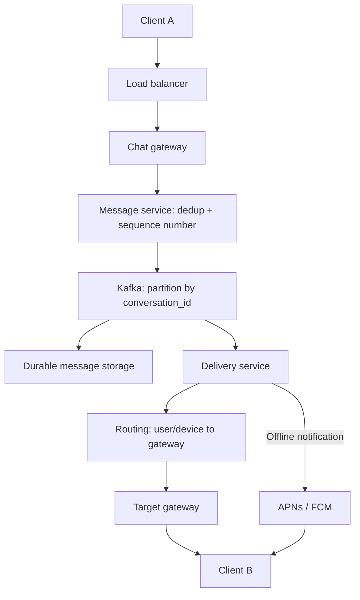

# Q4 · Chat / Messaging

> Difficulty: Medium | archetype: state sync (long-lived connection)
> The hard part of this question is not "add a WebSocket" — it's handling all of the following at once: the real-time delivery path, in-conversation ordering, offline recovery, group chat scaling, and end-to-end encryption. The through-line of this chapter: **how do you actually implement the real-time features** — how to pick a transport, how a connection stays alive, which path each of the three ticks takes, and how ephemeral signals like typing/presence take the shortcut.

## 1. Problem Statement

"Design a WhatsApp-scale chat system: 1:1 chat, group chat, online presence, typing indicator, read receipts, offline delivery, and end-to-end encryption (E2EE)."

E2EE does not require you to design a full key-agreement protocol, but you must be explicit: **the server routes and stores ciphertext and must not read plaintext messages** — this is an architectural boundary, not a throwaway line tacked on at the end.

## 2. Clarifying Questions

| Question | Intent |
|------|------|
| What's the max group size? (1:1 / hundred-person group / ten-thousand-person channel) | fan-out complexity differs by three orders of magnitude |
| How real-time does online presence need to be? | basis for the selection in the push model |
| What's the scope of message ordering? (Within the same session? Global?) | **You must ask this** — ordering is the technical core of this question |
| Who confirms "delivered"? (pushed out counts / app-process ACK) | determines the ack point of the tick state machine |
| Offline message retention period? | storage estimation |
| Is multi-device sync required? Unsend/edit? | sync semantics complexity doubles |
| Is E2EE required? | determines server visibility, search capability, and the media upload flow |
| After the app is killed, do messages still need to arrive instantly? | determines where push notification (APNs/FCM) sits in the architecture |

Good default assumptions: retain message bodies for one year; online users ≈ 10%–20% of DAU; presence is allowed to be ~30 seconds stale.

## 3. Estimation Walkthrough

```
50M DAU, 40 messages/user/day ≈ 2B msg/day ≈ 23K msg/s average (peak ×3–5 ≈ 70K–115K/s)
concurrent online users ≈ 5–10M long-lived connections
one connection gateway node (16GB memory) handles ~100K connections → need 50–100 connection layer nodes (plus redundancy and rolling-deploy headroom)
(Real WhatsApp reference: Erlang + FreeBSD, ~2M connections per box — an order-of-magnitude reference, not a design target)
message 160B (WhatsApp-class) + metadata ≈ 500B per message
storage = 2B × 500B × 365 ≈ 365TB/year, three replicas ≈ 1.1PB/year → sharding by conversation is mandatory
media is not counted here and goes down a separate object storage path
typing indicator / presence never enter storage: pure in-flight signals, zero storage cost
```

The conclusion of this estimation is not "you must use a particular database." It's three things: messages have to be sharded by conversation, because a single table cannot absorb the write volume; the connection layer and the storage layer scale independently; and media must not sit on the low-latency text-message hot path.

## 4. High-Level Design



One point people get wrong: **a gateway is not fully stateless** — the TCP/WebSocket connection lives in its memory. What's actually externalized is the recoverable `user_id → gateway_id` routing state. That way, when any gateway fails, the client can reconnect to a different instance, and the delivery service never depends on one machine's private memory.

## 5. Data Model

```sql
messages (
  conversation_id,       -- partition key
  bucket,                -- split by date or sequence range so partitions never grow unbounded
  sequence_no,           -- assigned by the server, monotonically increasing within a conversation — the basis for display and gap-filling; never trust client timestamps
  message_id,            -- canonical ID (TIMEUUID-compatible)
  sender_id,
  ciphertext,            -- E2EE: what's stored is ciphertext
  type,
  created_at,
  PRIMARY KEY ((conversation_id, bucket), sequence_no)
)

user_conversation_state (           -- per-user cursor: incremental sync on reconnect depends entirely on this
  user_id,
  conversation_id,
  last_delivered_seq,               -- double tick cursor
  last_read_seq,                    -- blue tick cursor
  unread_count,
  updated_at,
  PRIMARY KEY (user_id, conversation_id)
)

message_dedup (
  sender_id,
  client_message_id,                 -- generated by the client before a retry; the idempotency key
  canonical_message_id,
  PRIMARY KEY (sender_id, client_message_id)
)
```

The core ideas:

- `messages` is the **authoritative message log for each conversation (a single copy)**; you do not duplicate the body once for the sender and once for the receiver;
- `sequence_no` is assigned by the server on the write path and carries the core requirement of "in-conversation ordering" (the partition key + sequence design implements it directly);
- `client_message_id` gives you idempotent dedup;
- Don't memorize one specific database — Cassandra / DynamoDB / a relationally-sharded-by-conversation store can all work. What matters is the write pattern, in-conversation ordering, cursor-based reads, and the shard-scaling path.

## 6. Deep Dives

### Deep Dive A · How to choose the real-time transport (must-know, one of the core sections of this chapter)

| Option | Direction | Latency | Mobile battery drain | Best fit |
|------|------|---------|------------|------|
| HTTP short polling | pull | Poor (interval-bound) | High (the radio wakes repeatedly) | Anti-pattern |
| long polling | pull → pseudo-push | Medium | Medium | Fallback when WS is unavailable |
| SSE | server→client one-way | Good | Low | Downlink only (market data push); not enough for chat |
| WebSocket | bidirectional | Good | Low | The workhorse on web |
| MQTT (over TCP/TLS) | bidirectional | Good | Very low | **The industry answer for mobile messaging** (WhatsApp/Facebook Messenger-class protocols, and a large share of IM SDKs) |

**Why mobile IM favors MQTT over raw WebSocket** — this is the E5 differentiator:

- **Protocol overhead**: an MQTT fixed header is 2 bytes minimum, and a long-lived-connection keepalive PINGREQ is also just 2 bytes; a WebSocket frame plus an application-layer JSON heartbeat easily runs into the hundreds of bytes. At tens of millions of connections, the heartbeat traffic differs by two orders of magnitude.
- **QoS is built in**: MQTT natively has QoS 0 (fire-and-forget, pairs with typing indicators) / QoS 1 (at-least-once + message-id dedup, pairs with the message body) / QoS 2 (a four-step exactly-once handshake, which IM generally avoids — too expensive). **"Ephemeral signals ride QoS 0, durable messages ride QoS 1" says in one sentence that you think in tiers.**
- **Persistent session**: an MQTT broker can hold the subscription + offline messages (QoS 1) on the client's behalf and auto-redeliver on reconnect — a protocol-level implementation of session resume.
- **Keepalive is built in**: the protocol negotiates keepalive natively, which is exactly what carries presence.

**Real-system reference**: WhatsApp's servers are Erlang/OTP + FreeBSD — BEAM's lightweight process model gives you one process per connection at KB-level memory overhead, scaling to ~2M connections per box; the protocol is a private one evolved from XMPP (later converging toward an MQTT style). One line in the interview — "Erlang's per-connection process model is the underlying logic for connection layer selection" — is extremely high value.

### Deep Dive B · Connection lifecycle and session resume

The full life of one connection:

```
1. TCP + TLS handshake → 2. application-layer auth (token + device_id binding)
→ 3. register routing (user+device → gateway + connection_id, Redis, TTL = 3×heartbeat)
→ 4. steady state: heartbeat (keepalive) + send/receive
→ 5. disconnect → jittered backoff reconnect → resume (carrying the last_received_seq cursor)
```

Four pitfalls you must bring up unprompted:

- **The heartbeat interval is forced on you by NAT/firewalls**: carrier NAT table entries commonly time out at the 5-minute scale, so keepalive must be shorter than that; but it can't be too frequent either — waking the mobile radio from idle once is a noticeable power draw. **Production commonly lands at 30s–2min, with different intervals for foreground and background** (30s in the foreground; 5min in the background, or just disconnect and rely on push notification).
- **Session resume instead of a full resync**: on reconnect the client brings a `(conversation_id, last_received_seq)` cursor, and the delivery service back-fills the difference using `user_conversation_state` (`GET /conversations/{id}/messages?after_sequence_no=N`). **Pulling the entire history on every subway transfer is a disaster** — the design goal is a resume cost of O(gap), not O(history).
- **Reconnect storm**: the train pulls into the station, a data center hiccups → a million clients reconnect at once. The solution is a combination: random jittered backoff on the client side (spreading out arrival times); admission control on the gateway side (rate-limit connection establishment — better to be 5 seconds slow than to avalanche); and the auth service prioritizing resume requests (distinguishing "new session" from "resume").
- **Routing table cleanup**: when a gateway crashes, its routing entries disappear via TTL expiry; on graceful shutdown it removes them explicitly and lets the client reconnect. Correctness after a reconnect doesn't depend on "the connection never breaks" — it depends on pulling the difference by cursor.

### Deep Dive C · The real-time delivery pipeline: the three ticks are three different paths

Behind WhatsApp's UI state machine (✓ / ✓✓ / blue ✓✓) are three different server paths. Being able to tease them apart is E5-level:

| UI state | Semantics | Acked by | Trigger path |
|---------|------|--------|---------|
| ✓ single tick | The server has received it and it's on the recoverable persistence path | server | message service successfully writes to Cassandra → ack back to the sender (via the sender's gateway) |
| ✓✓ double tick | Delivered to the recipient's device | **the recipient's device** | delivery service delivers it and the client has actually received it and persisted it locally (not "pushed out the door and done") → a state-change event back to the sender |
| Blue ✓✓ | Read | the recipient's device | The user reads the message → the client reports the `last_read_seq` cursor → the server updates `user_conversation_state` → the sender is notified |

Three details you have to get across:

- **The ACK loop is itself a real-time push**: the double tick / blue tick don't come from the sender polling — the server pushes the state-change event down over the sender's own long-lived connection. What if the sender is offline when the tick changes? On reconnect, reconcile by the outbox-side cursor. **Tick state is eventually consistent, not strongly real-time.**
- **The definition of "delivered" gets locked down during clarification**: is it "pushed to the device" (FCM/APNs received it, so it counts) or "confirmed by the app process" (application-layer ACK)? The latter is more accurate, but when the app has been killed it can never reach the double tick — **which is exactly why the push notification path exists**: app killed → FCM/APNs delivers a system notification (wake-up only, not a reliable channel) → user taps it → app cold-starts → runs an incremental resume pull → the ACK gets filled in.
- **The typing indicator is the canonical ephemeral signal**: not persisted, no delivery guarantee (QoS 0), throttled on the client (at most one per key every few seconds), and the gateway looks up routing and fans out directly to the peer — **completely bypassing the message pipeline**. Drawing the two lines on the whiteboard — "durable goes through the pipeline, ephemeral takes the shortcut" — is the single best moment in this chapter.
- **Presence works the same way**: heartbeat report → state service (Redis `user:{id}` with TTL) → the change event is pushed only to people who currently have a session open with you (a subscription model). The trade-off: "State is allowed to be 30 seconds stale, and what you save is millions of QPS of broadcast-to-everyone. Nobody files a complaint because a friend shows offline while they're actually online."

### Deep Dive D · Reliable delivery: dedup, ordering, and gap-filling

The sender will always retry after a timeout. If the server already wrote successfully but the ack packet was lost, then without an idempotency key you get duplicate messages. The combination:

- **dedup**: the client generates `client_message_id` before retrying, and the server dedups idempotently on `(sender_id, client_message_id)` — a duplicate request returns the result of the first write
- **ordering**: `sequence_no` is assigned by the server on the write path (the same conversation routes to the same partition / ordering authority); different conversations don't need a global ordering. If the receiver sees a hole in the sequence numbers: wait briefly → request a back-fill → render by `sequence_no`
- **offline delivery**: on reconnect, pull the difference by cursor — "push and pull combined: online goes through push, and a failed push or an offline user goes through the pull fallback"
- **How to phrase the semantics**: at-least-once delivery + idempotent processing + reordering by conversation sequence number = **what the user perceives as approximately-once semantics** — watch your wording, and don't claim strict end-to-end exactly-once

### Deep Dive E · E2EE (you cannot skip this on a WhatsApp question)

The sender encrypts using the public key material of **each device** belonging to the receiver; the server only ever sees ciphertext, conversation routing information, and the metadata it needs. The server has to support public key / prekey distribution, but it must not hold keys that can decrypt the body.

The trade-offs this creates (bring them up proactively — they're bonus points):

- the server can't do plaintext full-text search, content understanding, or body-based recommendations;
- multi-device means every device has its own key material and delivery state;
- images/videos should also be encrypted on the client before upload, with the chat message carrying only the object reference and the information needed to decrypt it;
- the server can still do partial anti-abuse work based on metadata such as frequency and connection behavior, but its reach is limited.

Key-agreement protocol details (like Signal's Double Ratchet) are explicitly listed as follow-up deep dives — the point is to draw E2EE into the diagram as an architectural boundary.

### Deep Dive F · group chat fan-out

| Scenario | Primary strategy | Why |
|--------|---------|------|
| 1:1 and small groups (≤ 200) | write fan-out: one message × N recipient state records | Few members, so online delivery and unread state are easy to maintain, and latency is low |
| Large groups (thousands+) | hybrid write/read: the body is stored once, and one pointer is written into each member's conversation list | Replicating the body to every member blows up write amplification |
| Very large channels | a single conversation log + per-member cursors, with notification-driven pulls | "Every member receives every message immediately" degrades into on-demand sync |

**The dividing line is not a fixed "200 people" — it's `group size × message rate × acceptable delivery latency`** — this is what mature real-world systems (WeChat/Weibo) do.

In-group fan-out of real-time signals is counted separately: a typing indicator broadcast to everyone in a 200-person group is a 200× amplifier — **ephemeral signals can be sampled / aggregated / simply restricted to groups of ≤N people**, which is classic scope control.

### Deep Dive G · multi-device, offline sync, and media

- **multi-device**: each device gets its own `device_id` + its own connection routing + its own delivery/read cursors; a sent message is delivered to all of that user's active devices; read state is a product decision — "read on any device means read globally" or "each device is independent"; delete/unsend is a **sync event** (a tombstone pushed down through the message pipeline).
- **media**: the client encrypts and then requests a pre-signed URL from object storage for a direct upload → on success it sends a chat message carrying the object reference → large files never block the low-latency text channel; downloads are served via CDN.
- **offline always goes through cursors**: a push notification is only a nudge/wake-up and must not be treated as a reliable message channel.

## 7. Red Flags

- Using HTTP short polling as the core message channel and being unable to explain the cost
- Talking about WebSocket/MQTT but unable to answer "how does the server push a message to a specific user" (= no concept of a routing table)
- **No session resume design** (a full pull on every reconnect → you get stuck the moment they ask about the subway commute scenario)
- **No answer to reconnect storms** (a guaranteed follow-up on any million-scale long-connection system)
- Treating "the server received the request" as "sent," without specifying the persistence ack point
- Calling "at-least-once + idempotent" strict exactly-once
- Relying on client timestamps for ordering, or claiming you need a global message order
- Storing messages in a single MySQL table with no sharding story (2B writes/day going in)
- No dedup/ordering discussion (you get stuck the moment they ask "what happens when the network retry resends it")
- Broadcasting online presence to everyone (without ever counting the QPS)
- No cursor design for read receipts (full comparison every time?)
- Persisting the typing indicator / acking it (no tiers, wasted resources)
- Fully replicating the message body for every group member without discussing write amplification in large groups
- Treating APNs / FCM as reliable message storage
- The prompt clearly says WhatsApp, yet you completely omit end-to-end encryption
- Leaving one conversation forever in a single unbounded database partition

## 8. One-Minute Elevator Pitch

"The connection layer uses MQTT-over-TLS long connections — on mobile that's two orders of magnitude cheaper in heartbeat overhead than raw WebSocket, and QoS 0/1 naturally separates ephemeral signals from durable messages. 50–100 gateways, routing table externalized to Redis with a TTL, so after a gateway fails the client reconnects to any instance and recovers by cursor. Real-time features split into three tiers: the message body is E2EE-encrypted on the client and then goes API → Kafka partitioned by conversation → Cassandra, with `(conversation_id, bucket)` partitioning plus a server-assigned `sequence_no` giving explainable in-conversation order, and `(sender_id, client_message_id)` for idempotent dedup. The delivery/read ticks are separate state events that the server pushes back over the peer's own long connection, reconciled by cursor after a disconnect. Typing/presence are ephemeral signals: not persisted, the gateway looks up routing and pushes them straight through. Delivery semantics: at-least-once + idempotent + reorder by sequence number = approximately-once as the user sees it. Disconnects go through jittered backoff + session resume, an incremental back-fill costing O(gap); when the app is killed, FCM/APNs wakes it and a cold start does an incremental pull. Group chat divides on `member count × rate × latency tolerance`: write fan-out for small groups, a single log plus cursor reads for large ones. E2EE is an architectural boundary: the server only routes and stores ciphertext. Media is encrypted client-side and uploaded straight to object storage via a pre-signed URL, off the chat path entirely."

---

← [Q3 Top-K](03-top-k-heavy-hitters.md) | [Q5 News Feed →](05-news-feed.md)
