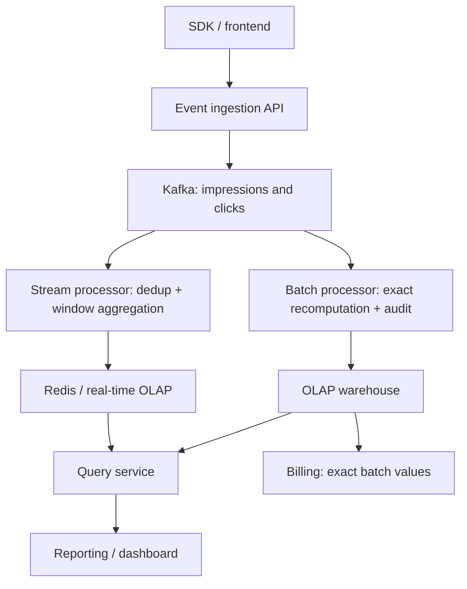

# Q8 · Ad Click Aggregator

> Difficulty: Medium–Hard | archetype: write-heavy + peak shaving + billing accuracy
> Hello Interview flagged this as an **E5 high-frequency problem**. It covers the whole streaming family: dedup, windowing, exactly-once, lambda/kappa. A sister problem to Q3 Top-K, but with the added dimension of **money**.

## 1. Problem Statement

"Design an ad data pipeline: collect ad impression and click events, aggregate each ad's CTR, produce reports by dimension, and provide the billing system with an accurate click bill."

## 2. Clarifying Questions

| Question | Intent |
|------|------|
| Event order of magnitude? Latency requirement (billing needs hour-level, reports need day-level?) | Decides the streaming/batch tiering |
| **How do you associate a click with its impression** (what about late clicks)? | The core technical difficulty of this problem |
| What dedup window for duplicate clicks (fraud/retry)? | Billing accuracy |
| What report dimensions (advertiser × time × geography)? | Dimensional modeling |
| Do we need real-time anti-fraud? | Scope control |

## 3. Estimation Walkthrough

```
1B impressions/day ≈ 12K/s average, peak 60K/s; CTR 1% → 10M clicks/day
raw events (retained 30 days for audit/recompute): 1.1B × 200B × 30 ≈ 6.6TB — object storage
after aggregation (ad × hour × dimension): GB-scale — trivial for an OLAP store
takeaway → two storage worlds: raw events go to the lake (immutable, recompute-able),
       aggregation results go to serving storage (low-latency queries). The architecture is necessarily streaming + batch layering
```

## 4. High-Level Design



**The narrative spine**: "The real-time layer serves ops (minute-level, approximate, recompute-able); the batch layer serves money (hour/day-level, exact, auditable) — **the same data, two timelines**. This is the textbook lambda scenario."

## 5. Data Model

```
events (immutable, JSON → Parquet into the data lake):
  impression: {imp_id, ad_id, user_id, page, geo, ts}
  click: {click_id, imp_id (FK), ad_id, ts}

aggregation table (OLAP, clustered by (ad_id, hour, dim...)):
  ad_stats_hourly (ad_id, ts_hour, geo, imp_count, click_count, ctr)
dedup state (streaming layer, RocksDB/Flink state): click_id → TTL window
```

**Key point**: the click carries an `imp_id` foreign key — "association isn't guessed from event-time proximity; it's an exact join on the ID relationship. **Event ordering can't be trusted; ID relationships can.**"

## 6. Deep Dives

### Deep Dive A · Out-of-order correlation of clicks and impressions (this problem's E5 crucible)

Problem: what if a click event arrives before its impression (different clients, different path latencies)?

- **Event-time session windows**: key clicks and impressions by `imp_id` into the same stream group and join within the window; out-of-orderness is handled by a **watermark** (e.g. allow 5 minutes of late arrival)
- Clicks later than the watermark → side output → sink to the data lake, absorbed by the batch layer
- "The CTR's numerator and denominator must come from the same window under the same **counting semantics** — the streaming layer's 5-minute-watermark join is the real-time counting semantics; the full-day recompute is the final counting semantics. The two will always differ, and reports must annotate that." (Counting-semantics awareness = a senior signal for data systems.)

### Deep Dive B · Dedup and anti-fraud (the money dimension of billing)

- Duplicate clicks: `click_id` idempotency + within-window `user_id+ad_id` frequency rules (10 rapid clicks count as 1)
- State storage: the streaming layer's local RocksDB state (not external Redis, avoiding inconsistent dual state writes); state TTL = dedup window
- Fraud signals (mention impression breadth): IP-range clustering, no mouse movement, abnormal click/impression timing distributions → rule-engine tagging → **excluded on the billing side**
- "The unit of billing is 'valid clicks' — dedup and anti-fraud rules must complete **before billing**. That's the reason the streaming layer exists, not just pretty real-time dashboards."

### Deep Dive C · Exactly-once all the way into OLAP

- Exactly-once in the streaming layer: Flink checkpoints (two-phase commit barriers) + transactional sink writes
- **Replay capability is the fallback for everything**: beyond Kafka retention, sink all raw events to the data lake — "if the streaming layer dies or the logic changes, replay and recompute from the lake; **the pipeline is a re-runnable program, not a one-shot data flow**" (kappa's replayable idea + lambda's exact batch layer; the hybrid is the answer)
- Idempotent OLAP writes: upsert with (ad_id, hour, dim) as the primary key, overwriting

### Deep Dive D · Traffic spikes and backpressure

- Super Bowl-scale moments: traffic ×50; tiered drop policy at the ingestion API (billing events never dropped; telemetry can be sampled)
- Kafka buffers, consumers pull at their own capacity; **backpressure propagates** to the ingestion side, returning 503 + Retry-After so SDKs back off
- "The priority of what to drop is a product decision, not a technical one — I'd write the SLAs for the three event classes into a table and have the business sign off."

## 7. Red Flags

- Only a real-time layer, no batch layer (billing can't run on a stream that may duplicate/lose)
- Correlating clicks and impressions by nearest-timestamp matching
- No dedup discussion (duplicate clicks going straight into the bill = a billing incident)
- Aggregation results written straight to MySQL for reports (dimensional aggregation queries will overwhelm OLTP)
- No concept of late data/watermarks

## 8. One-Minute Elevator Pitch

"Two-layer data flow: Kafka absorbs raw events (impression/click on separate topics, clicks carrying an imp_id foreign key for exact association rather than time-based guessing); the real-time layer in Flink does dedup (click_id idempotency + user frequency rules), watermark-based out-of-order joins, and minute-level pre-aggregation into in-memory OLAP for ops; the batch layer does a nightly full recompute into ClickHouse, and **billing defers to the batch layer**. All raw events land in the data lake to guarantee replayability — if the streaming layer dies, re-run from the lake. Under traffic spikes, drop events by tier (billing events never dropped). Real-time and final numbers will always differ; reports annotate the counting semantics — that's lambda's cost and its benefit."

---
← [Q7 Ticket Booking](07-ticket-booking.md) | [Back to 06 Overview](../06-classic-questions-overview.md)
